## Цель задачи
Данный комплекс заданий направлен на освоение ключевых аспектов работы с серверами и терминалом, включая:
- Управление процессами и многопоточными приложениями
- Работу с SSH-ключами и безопасную передачу данных
- Использование утилит для параллельной работы (tmux)
- Обработку геномных данных (Bowtie2, ClustalW)
- Диагностику и решение системных ошибок

---

# Выполнение заданий

### 1.   
**Ответ:**  
- Хранение общедоступных данных  
- Хранение больших объемов данных  
- Выполнение сложных вычислений  
- Хранение конфиденциальных данных  

**Причина:**  
Удалённые серверы обеспечивают масштабируемость, безопасность и вычислительные мощности, необходимые для этих задач. Они позволяют хранить данные разного уровня доступа и выполнять ресурсоёмкие операции.

---

### 2.   
**Ответ:** `id_rsa.pub`  

**Причина:**  
Публичный ключ (`id_rsa.pub`) безопасно передавать, так как он используется для шифрования данных. Приватный ключ (`id_rsa`) должен оставаться защищённым, поскольку даёт доступ к серверу.

---

### 3. 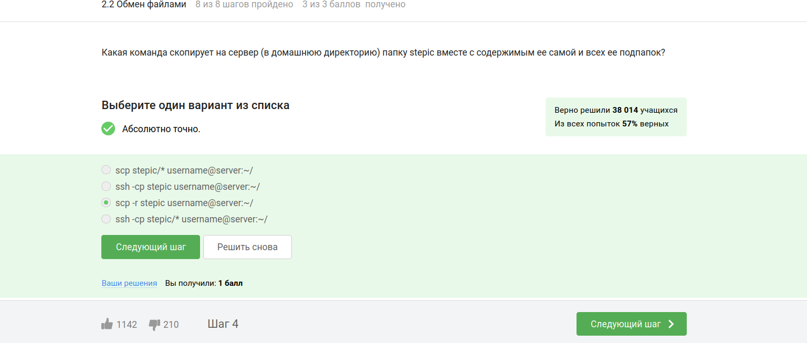  
**Ответ:** `scp -r stepic username@server:~/`  

**Причина:**  
Флаг `-r` обеспечивает рекурсивное копирование всей папки с содержимым. Другие варианты содержат ошибки в синтаксисе или используют неподходящие команды (`ssh` вместо `scp`).

---

### 4. 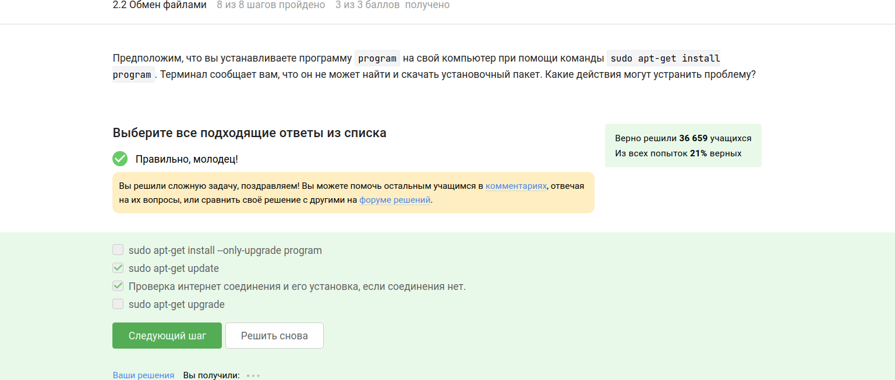  
**Ответ:**  
- `sudo apt-get update`  
- Проверка интернет-соединения  

**Причина:**  
`apt-get update` обновляет список доступных пакетов, что часто решает проблему. Отсутствие интернета также может быть причиной ошибки. Остальные варианты не актуальны для данной ситуации.

---

### 5.   
**Ответ:**  
- Для копирования файлов с компьютера на сервер  
- Для копирования файлов с сервера на компьютер  
- Для просмотра содержимого директорий на сервере  

**Причина:**  
FileZilla — это FTP-клиент, предназначенный для передачи файлов между устройствами и управления файлами на сервере. Локальные директории и установка программ — не его функции.

---

### 6. Контроль запускаемых программ  
**Изображение:**   
**Ответ:** Только о `program2` и `program3`.  

**Объяснение:**  
После выполнения команд:  
- `fg %1` возвращает `program1` в передний план, а затем она завершается командой `Ctrl+C`.  
- `fg %2` возвращает `program2` в передний план, но она приостанавливается командой `Ctrl+Z`.  
- Команда `jobs` показывает только задачи, которые находятся в фоновом режиме или приостановлены. В данном случае это `program2` (приостановлена) и `program3` (осталась в фоновом режиме).  

---

### 7. Запуск приложений: Clustal  
**Изображение:**   
**Ответ:** `clustalw test.fasta -align`  

**Объяснение:**  
- ClustalW — это версия программы Clustal для работы в терминале.  
- Команда `clustalw test.fasta -align` запускает ClustalW на файле `test.fasta` и выполняет множественное выравнивание.  
- Опция `-align` указывает, что нужно выполнить именно множественное выравнивание.  

---

### 8. Форматы данных для FastQC  
**Изображение:**   
**Ответ:** `bam`, `sam`, `fastq`, `bam_mapped`, `sam_mapped`.  

**Объяснение:**  
- FastQC — это программа для анализа данных секвенирования ДНК.  
- Она поддерживает следующие форматы данных:  
  - `bam` и `sam` — форматы для отображения геномных данных.  
  - `fastq` — формат для хранения данных секвенирования.  
  - `bam_mapped` и `sam_mapped` — отображают отображенные данные.  

---

### 9. Справочная информация о программе  
**Изображение:**   
**Ответ:**  
- `man program`  
- `help program`  
- `program --help`  

**Объяснение:**  
- Команда `man program` показывает справку из системы man (manual).  
- Команда `help program` может быть доступна в некоторых оболочках (например, в Bash).  
- Опция `--help` — это стандартный способ запроса справки в большинстве программ.  

---

### 10. Запуск программы на сервере  
**Изображение:**   
**Ответ:**  
- Проверить, есть ли другая версия этой программы (специально для терминала).  
- Настроить сервер, чтобы он поддерживал вывод информации на экран компьютера.  

**Объяснение:**  
Если программа требует графического интерфейса, но сервер не поддерживает его, можно:  
1. Использовать версию программы, которая работает в терминале.  
2. Настроить сервер для поддержки графического вывода (например, через X11 или VNC).  

---

### 11. Многопоточные приложения: Память  
**Изображение:** 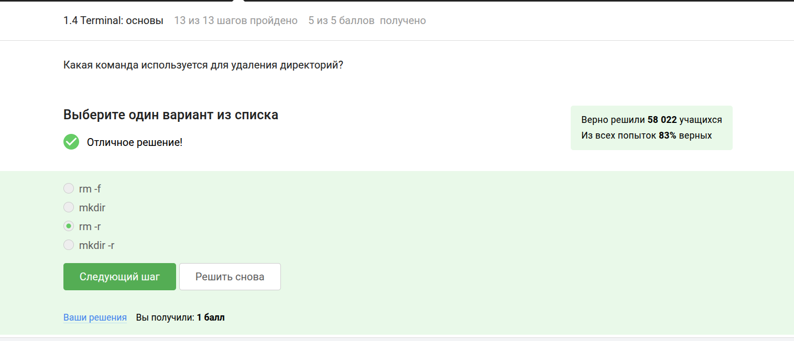  
**Вопрос:** Сколько памяти занимает остановленное (по Ctrl+Z) многопоточное приложение?  

**Ответ:** **Столько, сколько оно потребляло в момент остановки.**  

**Объяснение:**  
Когда приложение останавливается командой `Ctrl+Z`, оно переходит в состояние приостановки (SIGSTOP). В этом состоянии процесс продолжает занимать ту же самую память, которую он использовал до момента остановки.  

---

### 12. Многопоточные приложения: ЦПУ  
**Изображение:**   
**Вопрос:** Сколько вычислительных ресурсов центрального процессора (% CPU) использует остановленное (по Ctrl+Z) многопоточное приложение?  

**Ответ:** **0% CPU.**  

**Объяснение:**  
Когда приложение останавливается командой `Ctrl+Z`, оно переходит в состояние приостановки (SIGSTOP). В этом состоянии процесс не выполняет никаких вычислений и не использует ресурсы ЦПУ.  

---

### 13. Команда kill для приостановленного процесса  
**Изображение:** 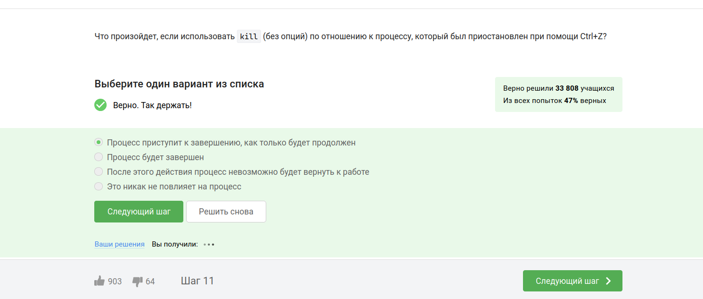  
**Вопрос:** Что произойдет, если использовать `kill` (без опций) по отношению к процессу, который был приостановлен при помощи Ctrl+Z?  

**Ответ:** **Процесс приступит к завершению, как только будет продолжен.**  

**Объяснение:**  
Команда `kill` отправляет сигнал SIGTERM процессу. Однако, если процесс приостановлен (SIGSTOP), он обработает сигнал только после возобновления работы (`fg` или `bg`).  

---

### 14. Команда для мгновенного завершения процесса  
**Изображение:** 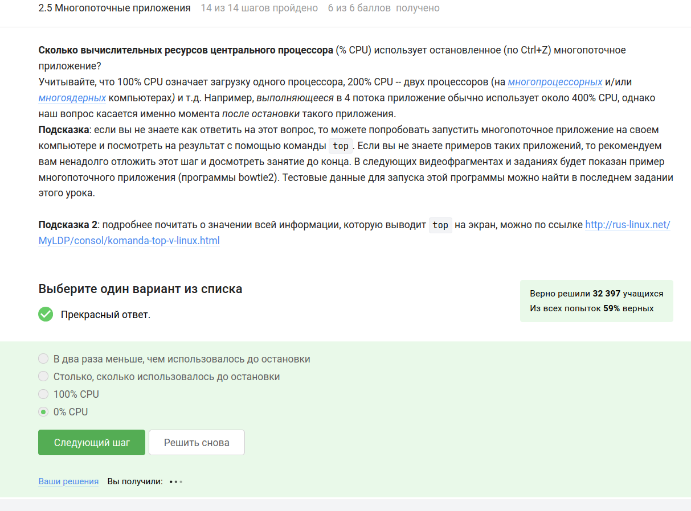  
**Вопрос:** С помощью какой команды можно мгновенно завершить остановленный процесс?  

**Ответ:** **kill -9.**  

**Объяснение:**  
Команда `kill -9` отправляет сигнал SIGKILL, который немедленно завершает процесс, даже если он находится в состоянии приостановки.  

---

### 15. Идентификаторы процессов в `jobs`, `top` и `ps`  
**Изображение:**   
**Вопрос:** Одинаковые ли идентификаторы процессов в `jobs`, `top` и `ps`?  

**Ответ:** **Одинаковые только у `ps` и `top`.**  

**Объяснение:**  
- `jobs` использует идентификаторы задач текущей сессии.  
- `top` и `ps` отображают системные PID, которые совпадают.  

---

### 16. Менеджер терминалов tmux: Разделение вкладок  
**Изображение:** 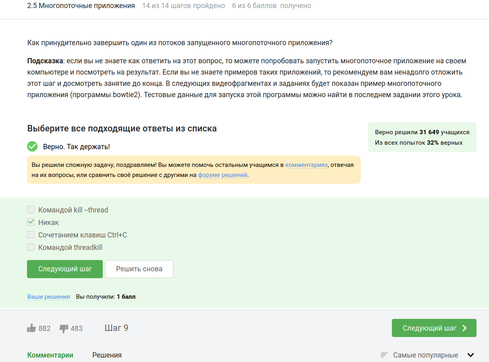  
**Правильные ответы:**  
- Перемещение между частями через `Ctrl+B` и стрелки.  
- Команда `exit` в части вкладки закрывает всю вкладку.  
- Команды разделения действуют только в текущей вкладке.  
- Закрытие части через `Ctrl+B` и `x`.  

**Объяснение:**  
tmux позволяет гибко управлять разделами, но изменения применяются только к текущей вкладке.  

---

### 17. Завершение работы tmux  
**Изображение:** 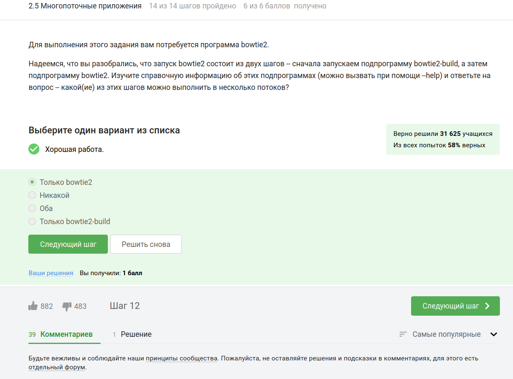  
**Вопрос:** Что произойдет, если ввести `exit` в последней вкладке tmux?  

**Ответ:** **tmux завершит работу.**  

**Объяснение:**  
tmux прекращает работу, когда закрыты все вкладки.  

---

### 18. Переключение между вкладками и продолжение процесса  
**Изображение:** 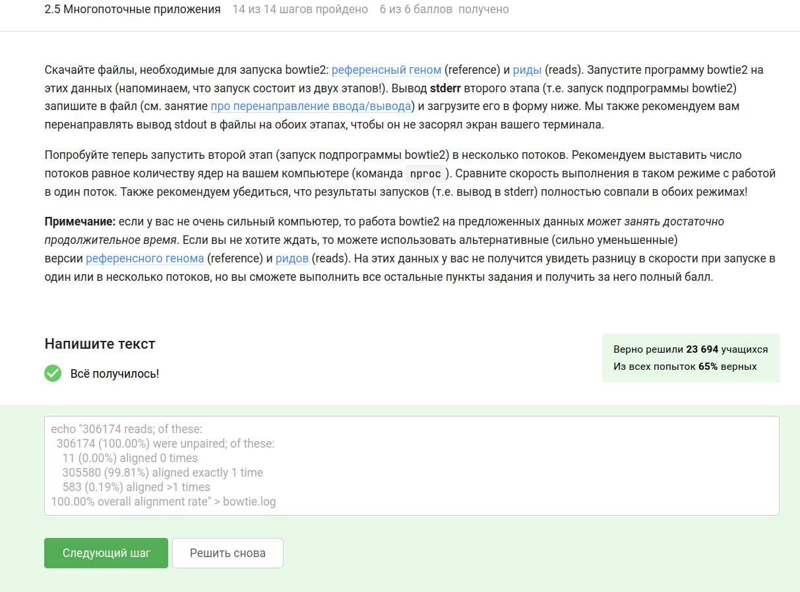  
**Вопрос:** Что произойдет при вызове `fg` в другой вкладке?  

**Ответ:** **Терминал сообщит об отсутствии процесса.**  

**Объяснение:**  
`fg` работает только в той вкладке, где процесс был приостановлен.  

---

### 19. Многопоточные приложения: Bowtie2  
**Изображение:** 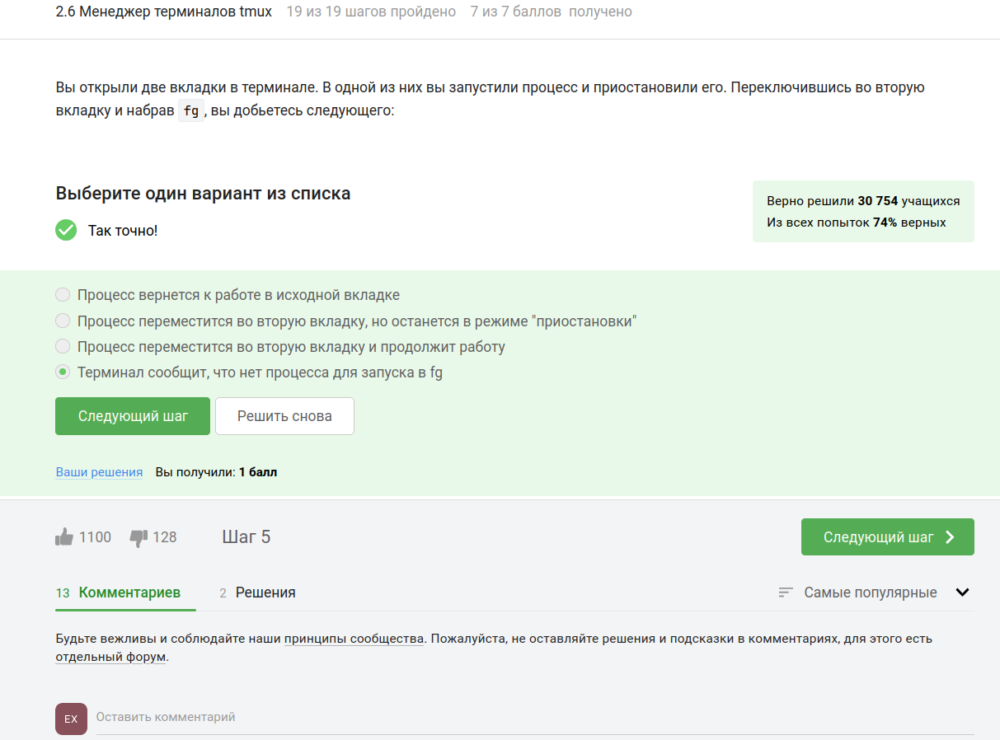  
**Ответ:**  
```bash
echo "306174 reads; of these:
... (статистика) ...
100.00% overall alignment rate" > bowtie.log
```  

**Объяснение:**  
Результаты второго этапа Bowtie2 записываются в файл `bowtie.log`.  

---

### 20. Параллельная работа в Bowtie2  
**Изображение:**   
**Вопрос:** Какой этап Bowtie2 можно распараллелить?  

**Ответ:** **Только bowtie2.**  

**Объяснение:**  
Этап выравнивания (`bowtie2`) поддерживает многопоточность, в отличие от создания индекса (`bowtie2-build`).  

---

### 21. Переименование вкладок tmux  
**Изображение:** 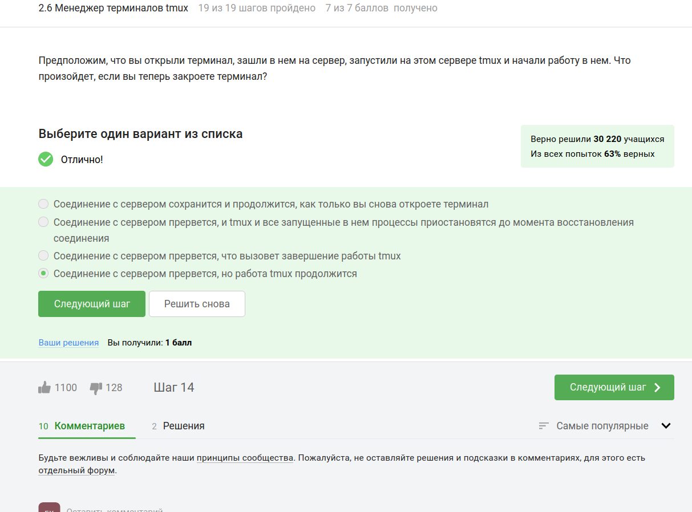  
**Ответ:** **Ctrl+B и , (запятая)**  

**Объяснение:**  
Комбинация `Ctrl+B` + `,` позволяет переименовать текущую вкладку.  

---

### 22. Закрытие вкладки tmux с фоновым процессом  
**Изображение:**   
**Ответ:** **Процесс завершится вместе с вкладкой.**  

**Объяснение:**  
Закрытие вкладки tmux останавливает все связанные с ней процессы.  

---

### 23. Закрытие терминала с tmux  
**Изображение:**   
**Ответ:** **tmux продолжит работу на сервере.**  

**Объяснение:**  
tmux работает независимо от терминала и сохраняет сессию на сервере.  

---

### 24. Менеджер терминалов tmux: Разделение вкладок (дубль)  
**Изображение:** 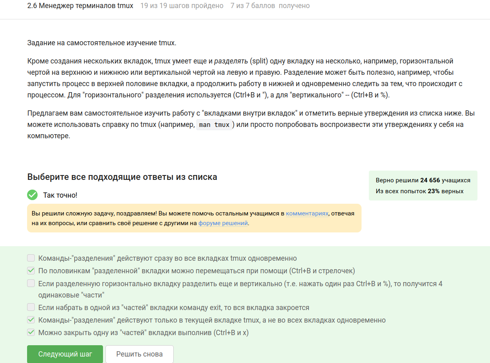  
**Ответ:**  
- Перемещение между частями через `Ctrl+B` и стрелки.  
- Команда `exit` закрывает всю вкладку.  
- Разделение действует только в текущей вкладке.  
- Закрытие части через `Ctrl+B` + `x`.  

**Объяснение:**  
Повторение предыдущих правил работы с tmux.  

---

## Заключение и выводы

### Основные достижения:
1. **Безопасность:**  
   - Правильное использование SSH-ключей.  
   - Безопасная передача файлов через SCP.  
2. **Управление процессами:**  
   - Работа с фоновыми задачами (`jobs`, `fg`, `Ctrl+Z`).  
   - Сигналы завершения (`kill`, `kill -9`).  
3. **Эффективная работа в терминале:**  
   - Использование tmux для параллельной работы.  
   - Настройка серверных приложений.  
4. **Обработка данных:**  
   - Работа с биоинформатическими инструментами (Bowtie2, ClustalW).  
   - Анализ геномных данных (форматы `fastq`, `bam`).  

