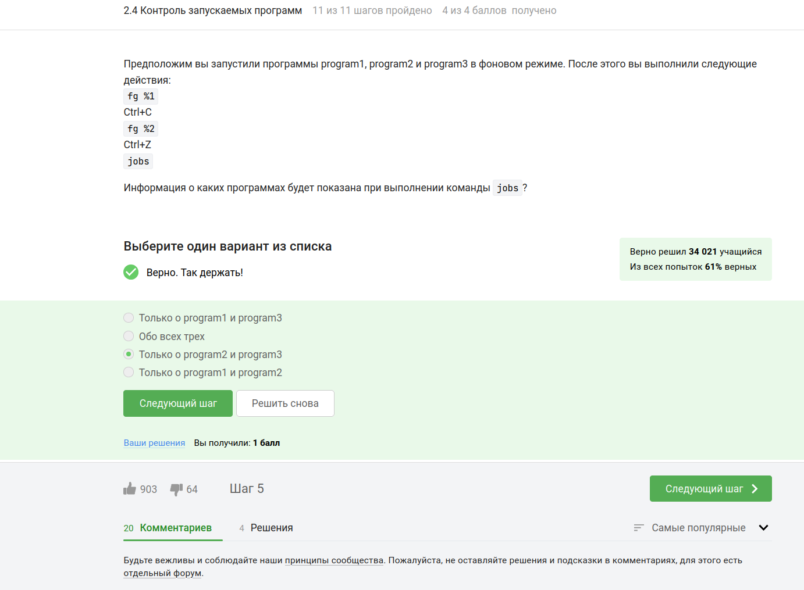
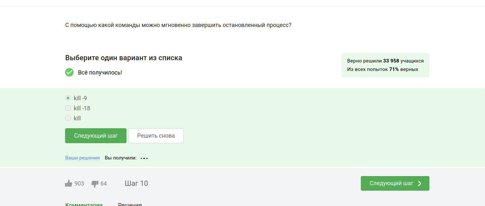
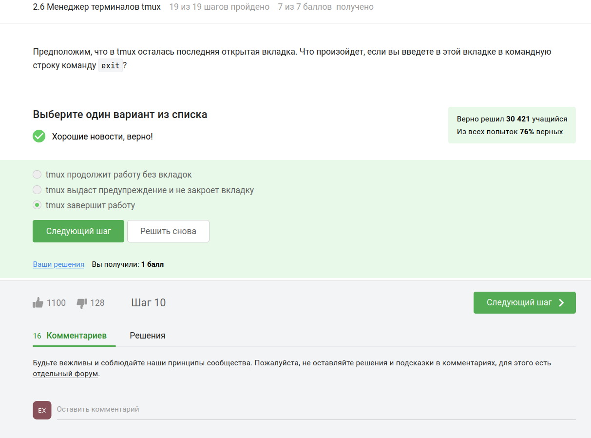
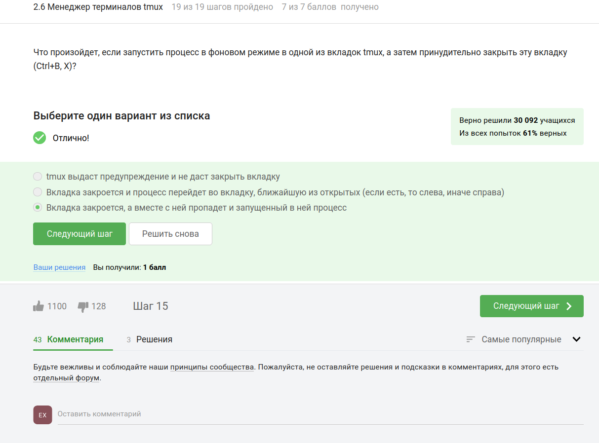

## Цель задачи
Данный комплекс заданий направлен на освоение ключевых аспектов работы с серверами и терминалом, включая:
- Управление процессами и многопоточными приложениями
- Работу с SSH-ключами и безопасную передачу данных
- Использование утилит для параллельной работы (tmux)
- Обработку геномных данных (Bowtie2, ClustalW)
- Диагностику и решение системных ошибок

---

# Выполнение заданий


### {#fig:001 width=70%}
**Ответ:**  
- Хранение общедоступных данных  
- Хранение больших объемов данных  
- Выполнение сложных вычислений  
- Хранение конфиденциальных данных  

**Причина:**  
Удалённые серверы обеспечивают масштабируемость, безопасность и вычислительные мощности, необходимые для этих задач. Они позволяют хранить данные разного уровня доступа и выполнять ресурсоёмкие операции.

---

### {#fig:002 width=70%} 
**Ответ:** `id_rsa.pub`  

**Причина:**  
Публичный ключ (`id_rsa.pub`) безопасно передавать, так как он используется для шифрования данных. Приватный ключ (`id_rsa`) должен оставаться защищённым, поскольку даёт доступ к серверу.

---

### {#fig:003 width=70%} 
**Ответ:** `scp -r stepic username@server~/`  

**Причина:**  
Флаг `-r` обеспечивает рекурсивное копирование всей папки с содержимым. Другие варианты содержат ошибки в синтаксисе или используют неподходящие команды (`ssh` вместо `scp`).

---

### {#fig:004 width=70%}  
**Ответ:**  
- `sudo apt-get update`  
- Проверка интернет-соединения  

**Причина:**  
`apt-get update` обновляет список доступных пакетов, что часто решает проблему. Отсутствие интернета также может быть причиной ошибки. Остальные варианты не актуальны для данной ситуации.

---

### {#fig:005 width=70%} 
**Ответ:**  
- Для копирования файлов с компьютера на сервер  
- Для копирования файлов с сервера на компьютер  
- Для просмотра содержимого директорий на сервере  

**Причина:**  
FileZilla - это FTP-клиент, предназначенный для передачи файлов между устройствами и управления файлами на сервере. Локальные директории и установка программ - не его функции.

Отлично! Вот markdown-код для всех пяти изображений с ответами и краткими объяснениями, а также включая ссылки на ваши фотографии:

---

### 6. Контроль запускаемых программ

{#fig:006 width=70%}

**Ответ:** Только о `program2` и `program3`.

**Объяснение:**
После выполнения команд:
- `fg %1` возвращает `program1` в передний план, а затем она завершается командой `Ctrl+C`.
- `fg %2` возвращает `program2` в передний план, но она приостанавливается командой `Ctrl+Z`.
- Команда `jobs` показывает только задачи, которые находятся в фоновом режиме или приостановлены. В данном случае это `program2` (приостановлена) и `program3` (осталась в фоновом режиме).

---

### 7. Запуск приложений: Clustal

{#fig:007 width=70%}

**Ответ:** `clustalw test.fasta -align`

**Объяснение:**
- ClustalW — это версия программы Clustal для работы в терминале.
- Команда `clustalw test.fasta -align` запускает ClustalW на файле `test.fasta` и выполняет множественное выравнивание.
- Опция `-align` указывает, что нужно выполнить именно множественное выравнивание.

---

### 8. Форматы данных для FastQC

{#fig:008 width=70%}

**Ответ:** `bam`, `sam`, `fastq`, `bam_mapped`, `sam_mapped`.

**Объяснение:**
- FastQC — это программа для анализа данных секвенирования ДНК.
- Она поддерживает следующие форматы данных:
  - `bam` и `sam` — форматы для отображения отображения геномных данных.
  - `fastq` — формат для хранения данных секвенирования.
  - `bam_mapped` и `sam_mapped` — отображают отображенные данные.

---

### 9. Справочная информация о программе

{#fig:009 width=70%}

**Ответ:**
- `man program`
- `help program`
- `program --help` (в некоторых программах бывает еще `-help` или `-h`)

**Объяснение:**
- Команда `man program` показывает справку из системы man (manual).
- Команда `help program` может быть доступна в некоторых оболочках (например, в Bash).
- Опция `--help` (или `-help`, `-h`) — это стандартный способ запроса справки в большинстве программ.

---

### 10. Запуск программы на сервере

{#fig:010 width=70%}

**Ответ:**
- Проверить, есть ли другая версия этой программы (специально для терминала).
- Настроить сервер, чтобы он поддерживал вывод информации на экран компьютера.

**Объяснение:**
- Если программа требует графического интерфейса, но сервер не поддерживает его, можно:
  1. Использовать версию программы, которая работает в терминале.
  2. Настроить сервер для поддержки графического вывода (например, через X11 или VNC).


---

### 11. Многопоточные приложения: Память

{#fig:011 width=70%}

**Вопрос:** Сколько памяти занимает остановленное (по Ctrl+Z) многопоточное приложение?

**Ответ:** **Столько, сколько оно потребляло в момент остановки.**

**Объяснение:**
Когда приложение останавливается командой `Ctrl+Z`, оно переходит в состояние приостановки (SIGSTOP). В этом состоянии процесс продолжает занимать ту же самую память, которую он использовал до момента остановки. Операционная система не освобождает память, пока процесс не будет завершен или перезапущен.

---

### 12. Многопоточные приложения: ЦПУ

{#fig:012 width=70%}

**Вопрос:** Сколько вычислительных ресурсов центрального процессора (% CPU) использует остановленное (по Ctrl+Z) многопоточное приложение?

**Ответ:** **0% CPU.**

**Объяснение:**
Когда приложение останавливается командой `Ctrl+Z`, оно переходит в состояние приостановки (SIGSTOP). В этом состоянии процесс не выполняет никаких вычислений и не использует ресурсы ЦПУ. Таким образом, его использование ЦПУ становится равным нулю.

---

### 13. Команда kill для приостановленного процесса

{#fig:013 width=70%}

**Вопрос:** Что произойдет, если использовать `kill` (без опций) по отношению к процессу, который был приостановлен при помощи Ctrl+Z?

**Ответ:** **Процесс приступит к завершению, как только будет продолжен.**

**Объяснение:**
Команда `kill` без дополнительных параметров отправляет сигнал SIGTERM процессу. Этот сигнал сообщает процессу, что ему нужно завершиться. Однако, если процесс находится в состоянии приостановки (SIGSTOP), он не может обрабатывать этот сигнал до тех пор, пока не будет продолжен (`fg` или `bg`). После продолжения процесс начнет завершение.

---

### 14. Команда для мгновенного завершения процесса

{#fig:014 width=70%}

**Вопрос:** С помощью какой команды можно мгновенно завершить остановленный процесс?

**Ответ:** **kill -9.**

**Объяснение:**
Команда `kill -9` отправляет сигнал SIGKILL процессу. Этот сигнал немедленно завершает процесс, даже если он находится в состоянии приостановки. В отличие от `kill` (без параметров), который отправляет мягкий сигнал SIGTERM, SIGKILL игнорирует любые состояния процесса и принудительно завершает его.

---

### 15. Идентификаторы процессов в `jobs`, `top` и `ps`

{#fig:015 width=70%}

**Вопрос:** `jobs`, `top` и `ps` позволяют отслеживать работу запущенных в терминале программ. В каждой из этих трех утилит для каждой запущенной программы указывается число-идентификатор. Одинаковые ли эти идентификаторы в `jobs`, `top` и `ps`?

**Ответ:** **Одинаковые только у `ps` и `top`.**

**Объяснение:**
- **`jobs`:** Эта утилита показывает идентификаторы задач, которые относятся к текущему shell-сессии. Эти идентификаторы уникальны для конкретной сессии и могут отличаться от системных PID.
- **`top` и `ps`:** Обе утилиты используют системные идентификаторы процессов (PID), которые одинаковы для всех процессов в системе. Поэтому идентификаторы процессов в `top` и `ps` будут совпадать, но они могут отличаться от идентификаторов в `jobs`.


---

### 16. Менеджер терминалов tmux: Разделение вкладок

{#fig:016 width=70%}

**Вопрос:** Выберите все подходящие утверждения о разделении вкладок в tmux.

**Правильные ответы:**
- По половинкам "разделенной" вкладки можно перемещаться при помощи (Ctrl+B и стрелочек).
- Если набрать в одной из "частей" вкладки команду `exit`, то вся вкладка закроется.
- Команды-"разделения" действуют только в текущей вкладке tmux, а не во всех вкладках одновременно.
- Можно закрыть одну из "частей" вкладки выполнив (Ctrl+B и x).

**Объяснение:**
- **Перемещение между частями:** В tmux можно использовать комбинацию `Ctrl+B` + стрелки для перемещения между разделенными частями вкладки.
- **Закрытие части вкладки:** Команда `exit` закрывает текущую часть вкладки, а комбинация `Ctrl+B` + `x` позволяет закрыть выбранную часть вкладки.
- **Действие команд разделения:** Команды разделения работают только в текущей активной вкладке, а не во всех вкладках одновременно.
- **Разделение вкладок:** После горизонтального разделения можно выполнить вертикальное разделение, чтобы создать четыре части.

---

### 17. Завершение работы tmux

{#fig:017 width=70%}

**Вопрос:** Предположим, что в tmux осталась последняя открытая вкладка. Что произойдет, если вы введете в этой вкладке команду `exit`?

**Ответ:** **tmux завершит работу.**

**Объяснение:**
Когда в tmux остается последняя вкладка и вы выполняете команду `exit`, tmux полностью завершает свою работу. Это связано с тем, что tmux прекращает работу, когда все его вкладки закрыты или завершены.

---

### 18. Переключение между вкладками и продолжение процесса

{#fig:018 width=70%}

**Вопрос:** Вы открыли две вкладки в терминале. В одной из них вы запустили процесс и приостановили его (`Ctrl+Z`). Переключившись во вторую вкладку и набрав `fg`, что произойдет?

**Ответ:** **Терминал сообщит, что нет процесса для запуска в fg.**

**Объяснение:**
Команда `fg` восстанавливает приостановленный процесс в передний план. Однако она работает только в той вкладке, где был приостановлен процесс. Если переключиться в другую вкладку и попробовать выполнить `fg`, терминал сообщит, что в этой вкладке нет приостановленного процесса.

---

### 19. Многопоточные приложения: Bowtie2

{#fig:019 width=70%}

**Вопрос:** Скачайте файлы, необходимые для запуска bowtie2, и запустите программу на этих данных. Выведите результаты второго этапа (запуск подпрограммы bowtie2) в файл.

**Ответ:** 
```bash
echo "306174 reads; of these:
306174 (100.00%) were unpaired; of these:
11 (0.00%) aligned 0 times
305580 (99.81%) aligned exactly 1 time
583 (0.19%) aligned >1 times
100.00% overall alignment rate" > bowtie.log
```

**Объяснение:**
Bowtie2 — это программа для выравнивания геномных данных. После выполнения второго этапа (выравнивание с использованием подпрограммы bowtie2), результаты записываются в файл. В данном случае вывод показывает статистику выравнивания, включая количество прочитанных фрагментов, их распределение по количеству выравниваний и общий процент выравнивания.

---

### 20. Параллельная работа в Bowtie2

{#fig:020 width=70%}

**Вопрос:** Какой из шагов запуска bowtie2 можно выполнить в несколько потоков?

**Ответ:** **Только bowtie2.**

**Объяснение:**
Bowtie2 состоит из двух этапов:
1. **bowtie2-build:** Создание индекса референсного генома. Этот этап обычно выполняется последовательно.
2. **bowtie2:** Выравнивание читов (reads) относительно референсного генома. Этот этап может быть выполнен параллельно, так как он использует многопоточность для ускорения процесса.

---

### 21. Менеджер терминалов tmux: Команды для переименования вкладок

{#fig:021 width=70%}

**Вопрос:** Изучите справку по tmux (например, `man tmux`) и выберите tmux-команду, которая отвечает за переименование текущей вкладки.

**Ответ:** **Ctrl+B и , (запятая)**

**Объяснение:**
В tmux команда для переименования текущей вкладки — это комбинация клавиш `Ctrl+B` + `,`. После нажатия этой комбинации вы можете ввести новое имя для вкладки и подтвердить его нажатием Enter.

---

### 22. Закрытие вкладки tmux с фоновым процессом

{#fig:022 width=70%}

**Вопрос:** Что произойдет, если запустить процесс в фоновом режиме в одной из вкладок tmux, а затем принудительно закрыть эту вкладку (`Ctrl+B`, X)?

**Ответ:** **Вкладка закроется, а вместе с ней пропадет и запущенный в ней процесс.**

**Объяснение:**
Когда вы закрываете вкладку tmux, все процессы, запущенные в этой вкладке (в том числе фоновые), будут завершены. Это связано с тем, что tmux уничтожает все ресурсы, связанные с данной вкладкой, включая запущенные процессы.

---

### 23. Закрытие терминала с tmux

{#fig:023 width=70%}

**Вопрос:** Предположим, что вы открыли терминал, зашли в нем на сервер, запустили на этом сервере tmux и начали работу в нем. Что произойдет, если вы теперь закроете терминал?

**Ответ:** **Соединение с сервером прервется, но работа tmux продолжится.**

**Объяснение:**
tmux — это программа, которая работает независимо от терминала. Когда вы закрываете терминал, соединение с сервером прерывается, но tmux продолжает работать в фоновом режиме. Все процессы, запущенные внутри tmux, остаются активными, и вы можете вернуться к ним позже, открыв новый терминал и восстановив соединение с tmux.

---
Отлично! Вот markdown-код для этого изображения с ответами и краткими объяснениями, а также включая ссылку на вашу фотографию:

---

### 24. Менеджер терминалов tmux: Разделение вкладок

{#fig:024 width=70%}

**Вопрос:** Выберите все подходящие утверждения о разделении вкладок в tmux.

**Правильные ответы:**
- По половинкам "разделенной" вкладки можно перемещаться при помощи (Ctrl+B и стрелочек).
- Если набрать в одной из "частей" вкладки команду `exit`, то вся вкладка закроется.
- Команды-"разделения" действуют только в текущей вкладке tmux, а не во всех вкладках одновременно.
- Можно закрыть одну из "частей" вкладки выполнив (Ctrl+B и x).

**Объяснение:**
1. **Перемещение между частями:** В tmux можно использовать комбинацию `Ctrl+B` + стрелки для перемещения между разделенными частями вкладки.
2. **Закрытие части вкладки:** Команда `exit` закрывает текущую часть вкладки, а комбинация `Ctrl+B` + `x` позволяет закрыть выбранную часть вкладки.
3. **Действие команд разделения:** Команды разделения работают только в текущей активной вкладке, а не во всех вкладках одновременно.
4. **Разделение вкладок:** После горизонтального разделения можно выполнить вертикальное разделение, чтобы создать четыре части.

---

## Заключение и выводы

### Основные достижения:
1. Освоение ключевых аспектов безопасности:
   - Правильное использование SSH-ключей
   - Безопасная передача файлов через SCP
2. Управление процессами:
   - Работа с фоновыми задачами (Ctrl+Z, `jobs`, `fg`)
   - Сигналы завершения процессов (`kill`, `kill -9`)
3. Эффективная работа в терминале:
   - Использование tmux для параллельной работы
   - Настройка серверных приложений
4. Обработка данных:
   - Работа с биоинформатическими инструментами (Bowtie2, ClustalW)
   - Анализ форматов геномных данных
