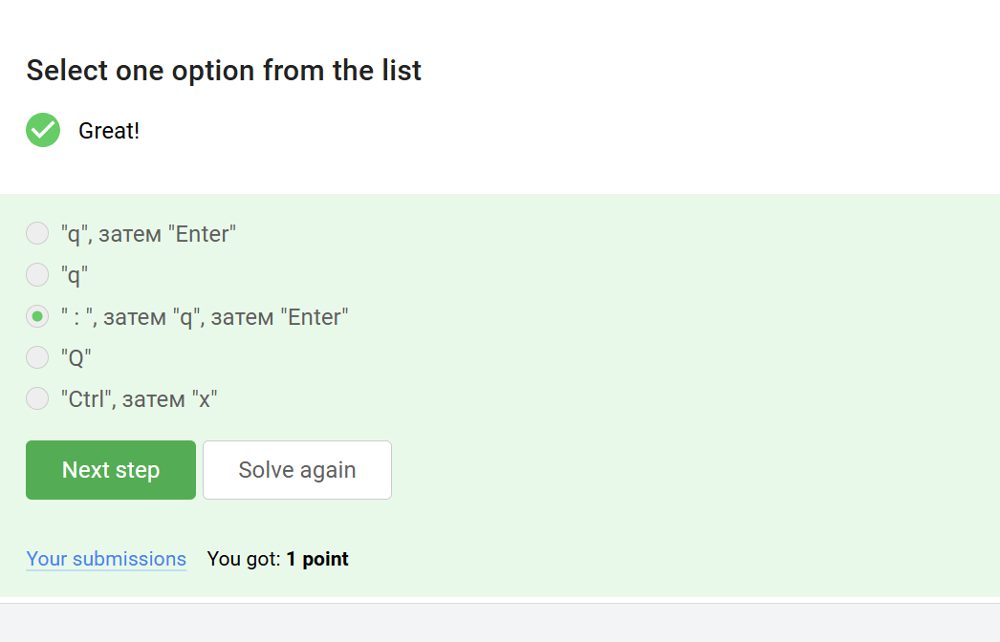
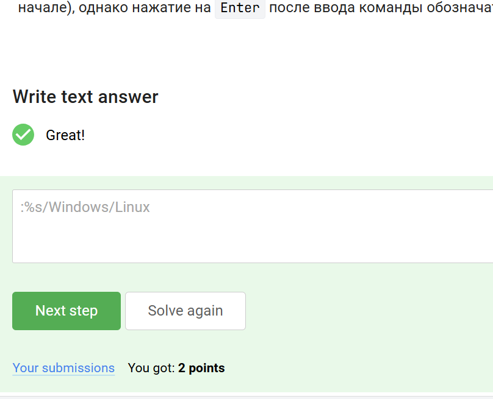
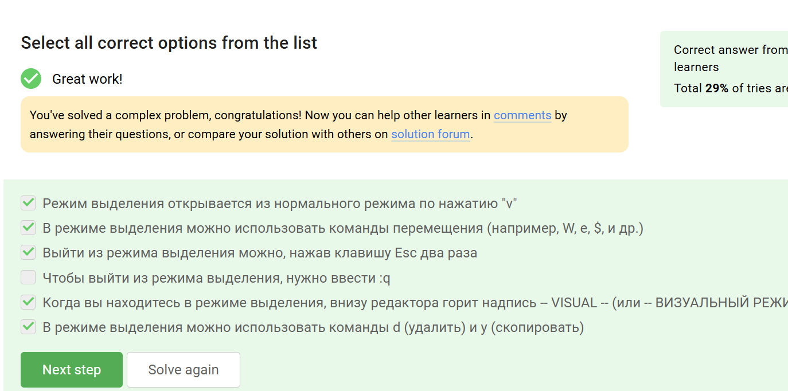
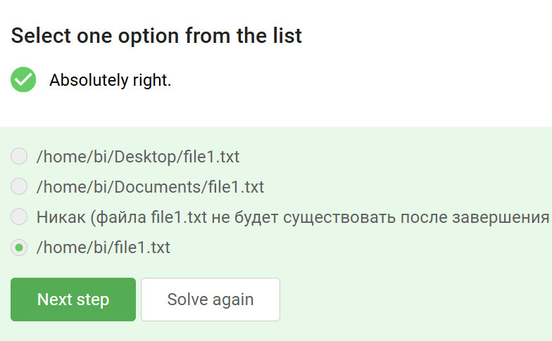
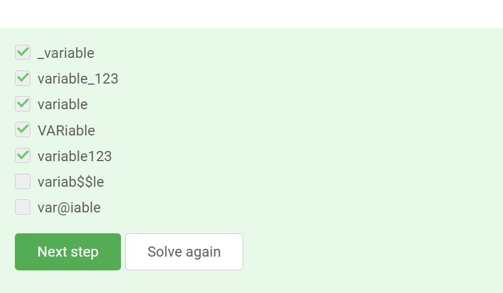
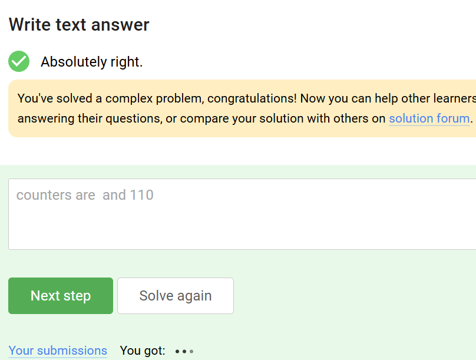
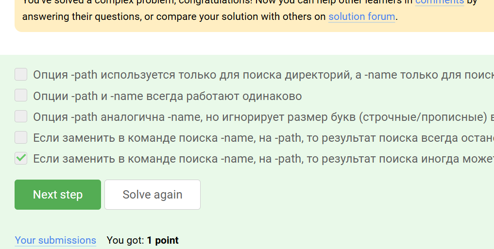

# Выполнение заданий

## 1. Используемые операционные системы
{#fig:001 width=70%}

**Ответ:** Linux, Windows  
**Обоснование:** На скриншоте (рис. \ref{fig:001}) показан выбор двух операционных систем для работы, что подтверждает их совместное использование.

## 2. Определение виртуальной машины
{#fig:002 width=70%}

**Ответ:** Специальная программа для запуска одной ОС внутри другой  
**Обоснование:** Рис. \ref{fig:002} демонстрирует правильное определение виртуальной машины как среды для запуска гостевой ОС.

## 3. Сохранение файла в формате FODT
{#fig:003 width=70%}

**Ответ:** Файл `gello_linux.fodt` успешно сохранен  
**Обоснование:** Как видно на рис. \ref{fig:003}, документ был экспортирован в открытый формат FODT с именем `gello_linux.fodt`, что подтверждается сообщением об успешной загрузке.

## 4. Формат пакетов в Ubuntu
{#fig:004 width=70%}

**Ответ:** .deb  
**Обоснование:** На рис. \ref{fig:004} показан стандартный формат пакетов для дистрибутивов на основе Debian, включая Ubuntu.


### 5. Автор VLC  
{#fig:005 width=70%}  
**Ответ:** Denis-Courmont  
**Обоснование:** Указано в разделе "About" программы.  

---  

### 6. Функции Update Manager  
{#fig:006 width=70%}  
**Ответ:**  
- Обновление системы до новой версии.  
- Установка новых программ.  
- Обновление установленного ПО.  
**Обоснование:** Это основные задачи менеджера обновлений в Linux.  

---  

### 7. Термины для командной строки  
{#fig:007 width=70%}  
**Ответ:** Терминал, Консоль.  
**Обоснование:** Оба термина корректны для интерфейса командной строки.  

---  

### 8. Команда `pwd`  
{#fig:008 width=70%}  
**Ответ:** `pwd`  
**Обоснование:** Команда выводит текущий рабочий каталог (Print Working Directory).  

---  

### 9. Эквиваленты команды `ls`  
{#fig:009 width=70%}  
**Ответ:**  
- `ls -Ah /some/directory`  
- `ls --human-readable -A -l /some/directory`  
**Обоснование:** Флаги `-A` (показывать скрытые файлы), `-h` (читаемый размер) и `-l` (длинный формат) эквивалентны.  

---  

### 10. Абсолютный и относительный пути  
{#fig:010 width=70%}  
**Ответ:**  
- `ls ./../Downloads` (относительный).  
- `ls /home/bi/Downloads` (абсолютный).  
**Обоснование:** Оба пути ведут к папке Downloads пользователя `bi`.  

---  

### 11. Удаление директорий  
{#fig:011 width=70%}  
**Ответ:** `rm -r`  
**Обоснование:** Флаг `-r` (рекурсивно) удаляет каталоги с содержимым.  

---  

### 12. Завершение работы терминала  
{#fig:012 width=70%}  
**Ответ:** Терминал закроется, Firefox останется работать.  
**Обоснование:** `exit` завершает сеанс терминала, но фоновые процессы не затрагиваются.  

---  

### 13. Запуск процесса в фоне  
{#fig:013 width=70%}  
**Ответ:** Запуск, затем `Ctrl+Z` + `bg`.  
**Обоснование:** Комбинация приостанавливает процесс (`Ctrl+Z`) и возобновляет его в фоне (`bg`), аналогично `&`.  

---  

### 14. Исполнение скрипта  
{#fig:014 width=70%}  
**Ответ:**  
```  
2025-05-12 17:07:26  
Control sum: 950  
```  
**Обоснование:** Скрипт выполнен после назначения прав (`chmod +x`).  

---  

### 15. Поток `stderr`  
{#fig:015 width=70%}  
**Ответ:** Выводится на экран.  
**Обоснование:** По умолчанию ошибки (`stderr`) направляются в терминал.  

---  

### 16. Перенаправление `stderr` в файл  
{#fig:016 width=70%}  
**Ответ:**  
- `program 2> file.txt`  
- `program >> file.txt 2>&1`  
**Обоснование:** Первый вариант записывает только ошибки, второй — добавляет вывод и ошибки в конец файла.  

---  

### 17. Конвейер и `stderr`  
{#fig:017 width=70%}  
**Ответ:** Ошибки выводятся в терминал.  
**Обоснование:** Конвейер (`|`) передаёт только `stdout`, `stderr` остаётся в терминале.  

---  

### 18. Скачивание файла через `wget`  
{#fig:018 width=70%}  
**Ответ:** `/home/alex/1.jpg`  
**Обоснование:** Файл сохранён в домашней директории пользователя `alex`.  

---  

### 19. Тихий режим `wget`  
{#fig:019 width=70%}  
**Ответ:** `-q` или `--quiet`  
**Обоснование:** Эти флаги отключают вывод лога загрузки.  

---  

### 20. Рекурсивная загрузка изображений  
{#fig:020 width=70%}  
**Ответ:** Будут загружены только `.jpg` файлы.  
**Обоснование:** Флаг `-A jpg` фильтрует файлы по расширению.  

---  

### 21. Удаление оригинала `gzip`  
{#fig:021 width=70%}  
**Ответ:** `gzip` удаляет исходный файл после сжатия.  
**Обоснование:** Это стандартное поведение утилиты.  

---  

### 22. Архивирование директорий  
{#fig:022 width=70%}  
**Ответ:** `tar`, `zip`  
**Обоснование:** Обе утилиты поддерживают создание архивов.  

---  

### 23. Опции `tar` для bzip2  
{#fig:023 width=70%}  
**Ответ:** `-cjf`  
**Обоснование:**  
- `-c` — создать архив.  
- `-j` — использовать bzip2.  
- `-f` — указать имя файла.  

---  

### 24. Маски поиска файлов  
{#fig:024 width=70%}  
**Ответ:**  
- `alexey.*`  
- `*.jpg`  
**Обоснование:** Маски соответствуют имени и расширению целевого файла.  

---  

### 25. Поиск слова `world`  
{#fig:025 width=70%}  
**Ответ:**  
- The world is not enough  
- The "world" is not enough  
- world  
- The beautiful-world is not enough  
**Обоснование:** Все варианты содержат искомое слово (регистронезависимо).  

---  

## Выводы  
В ходе работы освоены ключевые аспекты работы в Linux:  
- Управление файлами и директориями.  
- Перенаправление потоков ввода/вывода.  
- Использование утилит (`wget`, `grep`, `tar`).  
- Поиск и фильтрация данных.  
Приобретённые навыки позволяют эффективно решать задачи администрирования и автоматизации.  
```  
